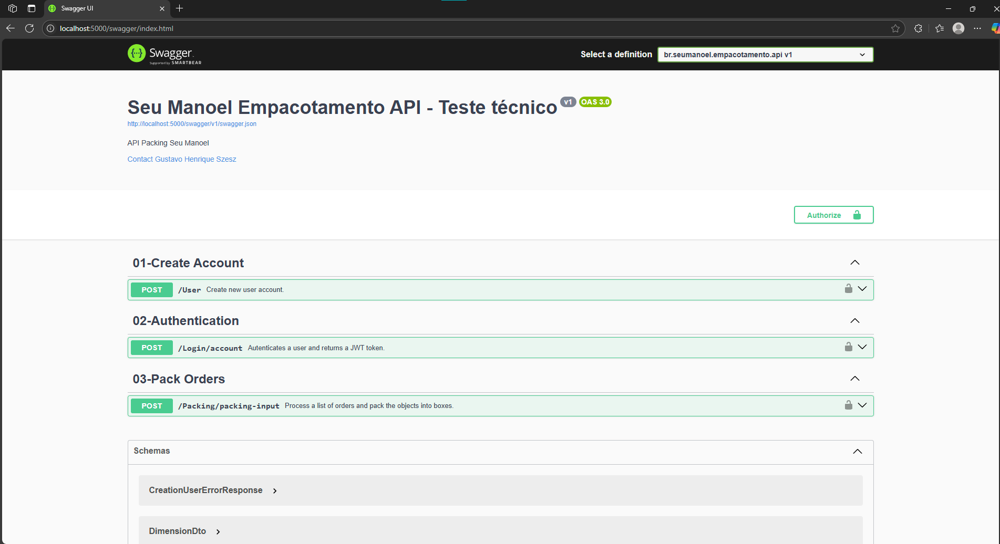
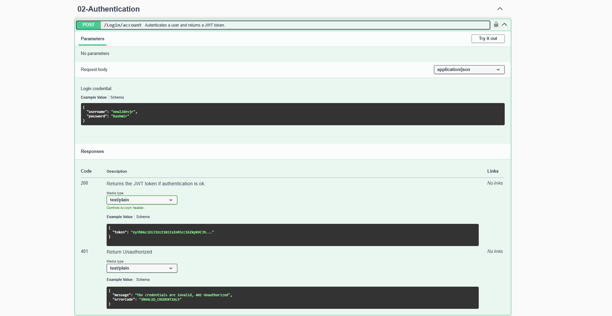
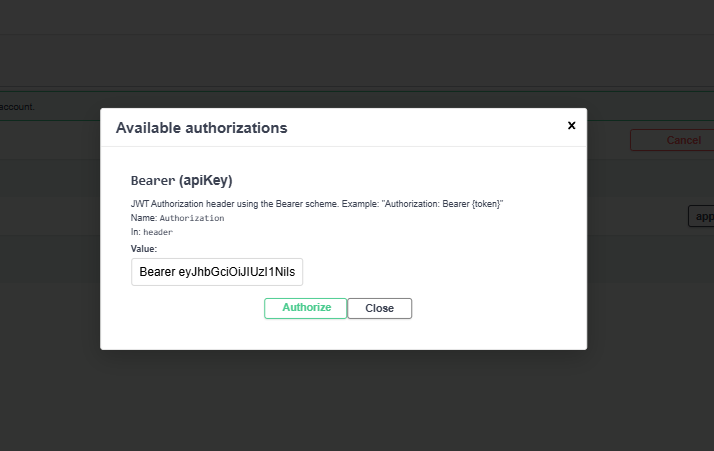

# SeuManoel.Empacotamento - Sistema de Empacotamento de Pedidos

<h3>Descrição</h3>
Um microserviço de API para otimização de empacotamento de produtos em caixas, desenvolvido para a loja de jogos online do Seu Manoel. Este sistema processa pedidos com produtos de diferentes dimensões (altura, largura e comprimento) e determina a melhor forma de embalá-los

Essa aplicação foi desenvolvida como teste técnico para a empresa L2 Code


## Índice

- Checklist de Requisitos 
- Pré-requisitos para rodar a aplicação
- Instalação e Execução
- Autenticação
- Endpoints da API
- Algoritmo de Empacotamento
- Estrutura do Projeto
- Testes

## Checklist de Requisitos para entrega do teste

### Requisitos Obrigatórios
- [x] Microserviço em .NET Core ou superior utilizando banco de dados SQL Server
- [x] Serviço e banco de dados rodam via Docker
- [x] README.md com pré-requisitos e comandos necessários para rodar a aplicação (docker-compose)
- [x] API possui Swagger e pode ser testada via Swagger
  

- [x] Código fonte disponível via repositório no GitHub

### Requisitos Opcionais
- [x] Segurança na autenticação da API 
- [x] Testes unitários 
  

---

## Pré-requisitos para rodar a aplicação

Para executar este projeto, você precisa ter instalado:
- [Docker](https://www.docker.com/get-started)
- [Docker Compose](https://docs.docker.com/compose/install/)

Fora o Docker, nenhuma instalação adicional é necessária, o .NET também esta rodando dentro de um Docker.

## Instalação e Execução

1. Clone o repositório:
   ```powershell
   git clone https://github.com/gustavo-szesz/SeuManoel.Empacotamento.git
   cd SeuManoel.Empacotamento
   ```

2. Crie o arquivo de variáveis de ambiente:
   - Copie o arquivo `.env.example` para `.env` na raiz do projeto:
     ```powershell
     copy .env.example .env
     ```
   - Edite o arquivo `.env` se necessário, ajustando as variáveis conforme seu ambiente.

3. Execute o projeto usando Docker Compose:
   ```powershell
   docker-compose up -d
   ```

   Este comando:
   - Constrói a imagem da aplicação
   - Inicia o SQL Server em um container
   - Inicia a API em outro container
   - Configura a rede entre os serviços (modo bridge)
   - Executa migração do banco de dados (dotnet ef)

4. A API estará disponível em:
   ```
   http://localhost:5000/swagger/index.html
   ```

5. Para encerrar a aplicação:
   ```powershell
   docker-compose down
   ```


## Autenticação

A API usa autenticação JWT para proteger os endpoints e cumprir
o requisito opcional de segurança na autenticação da API.

1. Primeiro, crie um usuário:
   - Acesse `POST /User` no Swagger
   - Insira username e senha

2. Faça login para obter um token:
   - Acesse `POST /Login` no Swagger
   - Use as mesmas credenciais
   - Copie o token JWT retornado

3. Autorize-se no Swagger:
   - Clique no botão "Authorize" no topo da página (Icone com um Cadeado)
   - Insira o token no formato: `Bearer {seu-token}`

O token tem validade de 1 hora. 

Swagger:



JWT:



## Endpoints da API

### Autenticação e Usuários
- `POST /User` - Cria um novo usuário
- `POST /Login` - Autentica usuário e retorna token JWT

### Empacotamento
- `POST /Packing/packing-input` - Processa pedidos para empacotamento

#### Exemplo de Payload:
```json
{
  "pedidos": [
    {
      "pedido_id": 1,
      "produtos": [
        {"produto_id": "PS5", "dimensoes": {"altura": 40, "largura": 10, "comprimento": 25}},
        {"produto_id": "Volante", "dimensoes": {"altura": 40, "largura": 30, "comprimento": 30}}
      ]
    }
  ]
}
```

#### Exemplo de Resposta:
```json
[
  {
    "pedido_id": 1,
    "caixas": [
      {
        "caixa_id": "Caixa 2",
        "produtos": ["PS5", "Volante"],
      }
    ]
  }
]
```


## Algoritmo de Empacotamento

O sistema implementa o algoritmo First Fit Decreasing para otimizar a alocação de produtos em caixas:

1. Ordena os produtos por volume (do maior para o menor)
2. Tenta encaixar os produtos na menor caixa possível
3. Se um produto não couber em nenhuma caixa, retorna uma observação adequada

Caixas disponíveis:
- Caixa 1: 30 x 40 x 80
- Caixa 2: 80 x 50 x 40
- Caixa 3: 50 x 80 x 60


Para maiores detalhes do algoritmo, veja a explicação em [`br.seumanoel.empacotamento.api/Services/PackingService.cs`](br.seumanoel.empacotamento.api/Services/PackingService.cs).

## Estrutura do Projeto

- `br.seumanoel.empacotamento.api/` - Projeto principal da API
  - `Controllers/` - Controladores da API
  - `Data/` - Contexto e Seed do banco de dados, ajuda a rodar as migrations na primeira vez executando o SQL Server 
  - `Factorie/` - Fabrica de objetos
  - `Interfaces/` - Interfaces para injeção de dependência
  - `Migrations/` - Migrações do Entity Framework
  - `Models/` - Entidades, DTOs, Enums (Para a Factory), ErrorResponse (Documentação Swagger) 
  - `Services/` - Lógica principal, incluindo o algoritmo de empacotamento
  - `Program.cs` - Configuração principal da aplicação
  - `Dockerfile` - Dockerfile da API
  - `entrada.json` / `saida.json` - Exemplos de payload fornecidos pela L2

- `br.seumanoel.empacotamento.tests/` - Projeto de testes unitários
  - `PackingControllerTests.cs` - Testes dos endpoints da API
  - `PackingServiceTests.cs` - Testes do algoritmo de empacotamento

- `Images/` - Imagens dos campos do Swagger
- `docker-compose.yml` - Orquestração dos containers (API e SQL Server)
- `.env.example` - Exemplo de variáveis de ambiente
- `README.md` - Guia principal

## Testes

Para executar os testes unitários:

```bash
# Dentro do container
dotnet test

# Ou localmente, se tiver o .NET SDK instalado
dotnet test br.seumanoel.empacotamento.tests/br.seumanoel.empacotamento.tests.csproj
```

---

